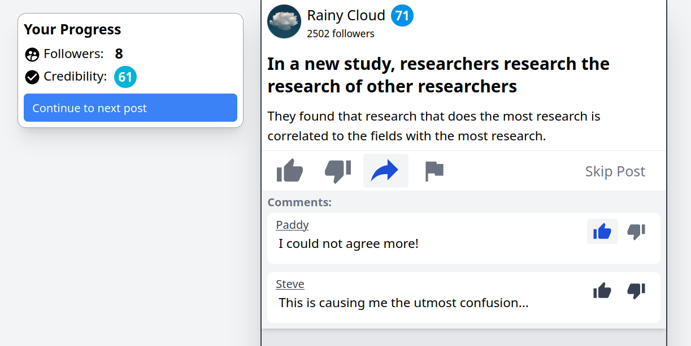

<h1 id="intro">
    The Misinformation Game
</h1>

The Misinformation Game is a social media simulator built to
study people's behaviour when they interact with social media.
To achieve this, The Misinformation Game simulates a social
media feed for research participants. Participants will be shown
one fake social media post at a time, and they may then react to
the post and its comments. The Misinformation Game has been
designed to be highly customisable so that tightly controlled
experiences can be created for participants. This customisability
is a core focus of The Misinformation Game, to facilitate the
research of a wide array of social media related questions.

### Example Game
If you would like to test playing through a study created using
the Misinformation Game, you can access an example game from
[the example game page](/link/ExampleGame).
You can enter any ID to access the example game.

### Example Results
If you would like to view an example of the results that can be
gathered when using the Misinformation Game, the results of a user
experience study are available from
[the example results page](/link/ExampleResults).

## Getting Started
The Misinformation Game contains many configuration options
to tailor the game for specific research purposes. To find
out whether The Misinformation Game is the right fit for
your research, we recommend that you read through the available
options for configuring your own study on the
[Study Configuration](/StudyConfiguration) page. Additionally,
the results that are made available for your analysis are
described on the [Results](/Results) page.

To conduct a study using The Misinformation Game, you will need
to host your own website for the game using Google Firebase.
The steps to host your own instance of the game are described in both a
[Non-Technical Installation Guide](/NonTechnicalInstallation)
and a [Technical Installation Guide](/TechnicalInstallation).
If you are proficient with the command-line and
installing technical tools, then the technical
installation guide will be quicker, and requires fewer
steps. However, if you are not familiar with these
technologies, then the non-technical installation
guide should be easier to follow.

## Usage Documentation
- [How to play The Misinformation Game](/HowToPlay) -
  The guide given to participants before they start a study.
- [Study Configuration](/StudyConfiguration) - A guide to create your own study.
- [Including Images in Studies](/Images) - Recommendations for including images in studies.
- [Results](/Results) - Descriptions of the results that are recorded by the game.
- [Managing Studies](/ManagingStudies) - How to upload, enable, disable, and delete your studies.
- [Registering Administrators](/Administrators) - How to securely assign administrator privileges.
- [Integration with Qualtrics](/QualtricsIntegration) - How to integrate a study into Qualtrics.

## Hosting Documentation
- [Firebase Pricing](/FirebasePricing) - A guide to estimate the hosting costs of running a study.
- [Non-Technical Installation Guide](/NonTechnicalInstallation) -
  A guide to host your own study using Firebase (longer, for non-technical users).
- [Technical Installation Guide](/TechnicalInstallation) -
  A guide to host your own study using Firebase (shorter, for technical users).
- [Updating your Installation](/Updating) -
  A guide to retrieve new features and fixes for your installation.

## System Documentation
- [Technical Overview](/TechnicalOverview) - A broad overview of the tech-stack used by the game.
- [Simulation](/Simulation) - An in-depth description on the simulation that powers the game.
- [Development](/Development) - A guide for developers to make adjustments to the game.
- [Documentation Development](/DocsDevelopment) - A guide for developers to make adjustments
  to this documentation website.
- [Original Design](/original-design) - The original, outdated, design document for the game.

## Other Useful Links
- [Source Code](https://github.com/TheMisinformationGame/MisinformationGame) -
  The Misinformation Game is proudly open-source! 
- [Issue Tracker](https://github.com/TheMisinformationGame/MisinformationGame/issues) -
  If you find any issues, please report them here.
- [Example Game](/link/ExampleGame) -
  Test out The Misinformation Game with an example game.
- [Example Results](/link/ExampleResults) -
  View the results of a user experience study ran using the Misinformation Game.
- [Study Configuration Template Spreadsheet](/link/StudyTemplate) -
  The template spreadsheet that should be edited to create your own study.
- [Example Game Configuration Spreadsheet](/link/ExampleStudy) -
  The study configuration spreadsheet that is used to create the example game.
